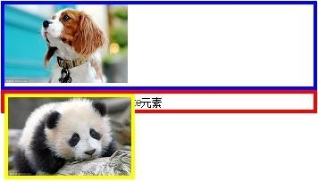

# absolute

與 float 類似的特性：

- 包裹性（display 會變成 inline-block）
- 高度欺騙（會跳出常規流，讓外層 div 高度為 0，因為它會以為 content 高度為 0 ）

從圖中明顯看出文字被圖片遮蓋了，這點和 float 不同。float 是欺騙父元素，讓其父元素誤以為其高度塌陷了，但 float 元素本身仍處於文檔流中，文字會環繞著 float 元素，不會被遮蔽。

但 absolute 其實已經不能算是欺騙父元素了，而是出現了**層級**關係。從父元素的視點看，設成absolute的圖片已經完全消失不見了，因此從最左邊開始顯示文字。而absolute的層級高，所以圖片遮蓋了文字。

## absolute 的定位點

### 指定了absolute，未指定left/top/right/bottom

此時absolute元素的左上角定位點位置就是該元素正常文檔流裡的位置。

### 給 absolute 元素指定了 left/top/right/bottom

定位於第一個非 position:static 的父元素，如果沒有，就定位於整個頁面的左上角。

若只設定 top/bottom，水平位置仍在該元素正常文檔流裡的位置。

若只設定 right/left，垂直位置該元素正常文檔流裡的位置。

## 和 z-index 間的關係

不要過度濫用 z-index，以下情況根本不需要設z-index：

- 讓 absolute 元素覆蓋正常文檔流內元素（不用設z-index，自然覆蓋）
- 讓後一個 absolute 元素覆蓋前一個absolute元素（不用設z-index，只要在HTML端正確設置元素順序即可）

什麼時候需要設置 z-index 呢？當 absolute 元素覆蓋另一個 absolute 元素，且HTML端不方便調整DOM的先後順序時，需要設置z-index: 1。非常少見的情況下多個absolute交錯覆蓋，或者需要顯示最高層次的模態對話框時，可以設置z-index > 1。

## 減少重繪和回流的開銷

absolute 控制隱藏和顯示：absolute+ top:-9999em 或 absolute + visibility:hidden。

用 display:none 會導致 render tree 重繪和回流，所以改用 absolute 效能可能會好一點。